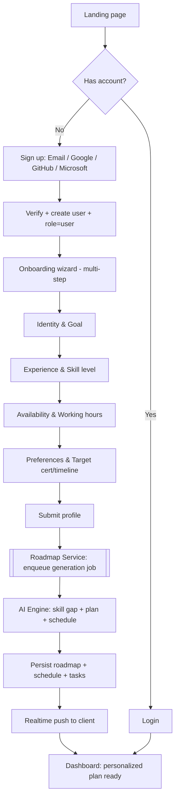
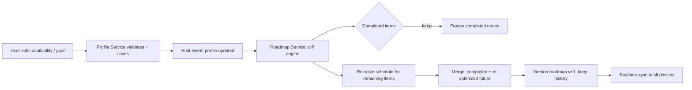
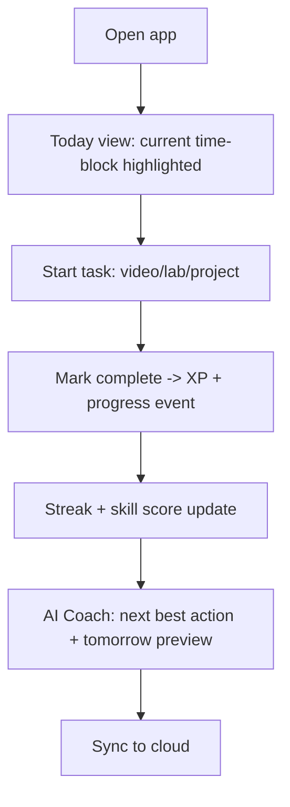
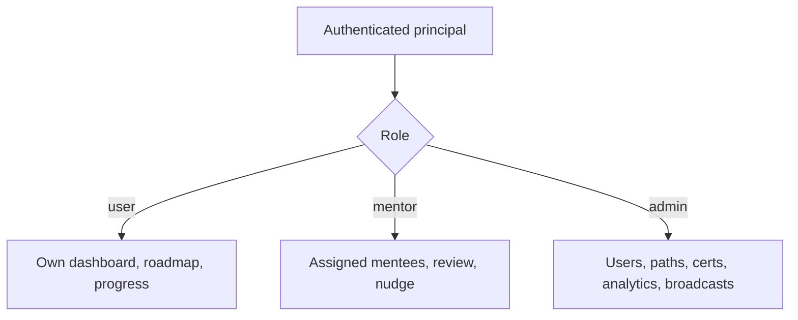
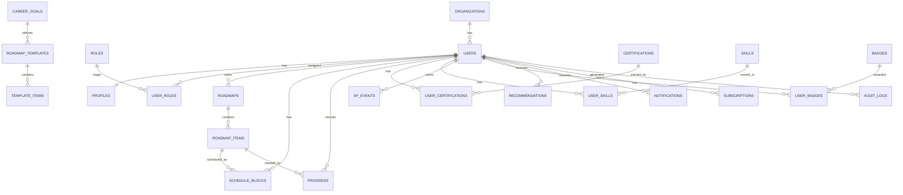
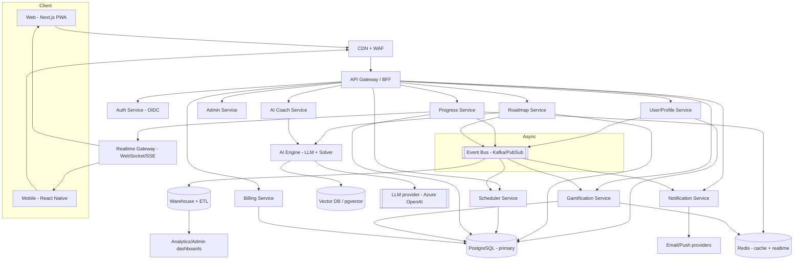
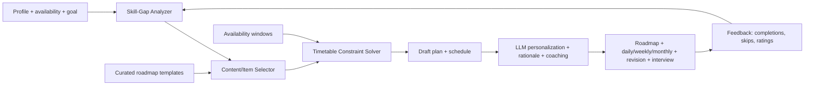

# PathPilot — Personalized Learning & Career Roadmap SaaS
### Product Requirements & Architecture Blueprint

> **Working product name:** PathPilot
> **One-liner:** A platform that turns each user's schedule, skills, and career goal into personalized roadmap templates and timetables today, with constraint-based adaptive planning on the product roadmap.
> **Author role context:** Senior PM · SaaS Architect · UX Designer · Solution Architect
> **Status:** v1.0 blueprint · **Date:** 2026-08-21

---

## Table of Contents
1. [Product Requirements Document (PRD)](#1-product-requirements-document-prd)
2. [User Flow Diagrams](#2-user-flow-diagrams)
3. [Database Schema](#3-database-schema)
4. [System Architecture](#4-system-architecture)
5. [API Design](#5-api-design)
6. [Dashboard Wireframes](#6-dashboard-wireframes)
7. [AI Recommendation Engine Design](#7-ai-recommendation-engine-design)
8. [Technology Stack](#8-technology-stack)
9. [MVP Features](#9-mvp-features)
10. [Phase-wise Development Roadmap](#10-phase-wise-development-roadmap)
11. [Monetization Strategy](#11-monetization-strategy)
12. [Security & Compliance Design](#12-security--compliance-design)

---

## 1. Product Requirements Document (PRD)

### 1.1 Vision
Become the default "career operating system" for aspiring technologists. Every learner gets a mentor-quality, continuously optimized plan tailored to their real life — the hours they actually have, the skills they already hold, and the exact role they want next.

### 1.2 Problem
- Learners drown in unstructured content and generic roadmaps that ignore their schedule and starting point.
- Certifications are chased without practical skill; motivation fades without feedback loops.
- Existing tools are either static (PDF roadmaps) or content marketplaces (courses) — neither *plans*, *adapts*, or *coaches*.

### 1.3 Target Users & Personas
| Persona | Description | Primary need |
|---|---|---|
| **Career Switcher** (e.g., Sujan) | Networking role → Cloud Architect | Realistic plan around a 9-to-3 job |
| **Fresh Graduate** | CS grad targeting AI/Data Engineer | Structure + projects + interview prep |
| **Upskiller** | Working dev adding DevOps/Cloud | Efficient, deadline-driven certification path |
| **Mentor** | Reviews mentees' plans/progress | Cohort visibility, nudges |
| **Admin** | Ops/content team | Manage paths, users, analytics, comms |

### 1.4 Goals & Non-Goals
**Goals**
- Personalized roadmap + timetable generated in < 30s from onboarding.
- Auto-regeneration on profile/schedule change **without losing completed progress**.
- Cross-device, real-time synced progress in a cloud DB.
- Measurable "Career Readiness Score" per goal.

**Non-Goals (v1)**
- Hosting course video content (we *reference/curate*, not host).
- Live human tutoring marketplace (Phase 3+).
- Full LMS/SCORM compliance.

### 1.5 Functional Requirements

**FR-1 Intelligent Onboarding** — capture all fields below; validate; persist to profile; trigger roadmap generation.
- Identity: Full Name, Email
- Goal: Career Goal, Target Certification, Target Completion Timeline, Areas of Interest
- Context: Current Role, Years of Experience, Skill Level
- Availability: Daily Working Hours, Work Start/End, Learning Hours During Work, Learning Hours After Work
- Preferences: Learning Style(s), Preferred Cloud Provider

**FR-2 Multi-User & Auth** — Email/Password, Google, GitHub, Microsoft (OIDC). RBAC roles: `user`, `mentor`, `admin`. Secure cloud storage. Sessions valid across devices.

**FR-3 Smart Profile Management** — user-editable working hours, goal, availability, certs, technologies, weekly schedule. Any change → **incremental** roadmap re-optimization preserving `completed` items.

**FR-4 AI Timetable Generator** — produce Daily Schedule, Weekly Plan, Monthly Plan, Certification Roadmap, Project Roadmap, Revision Schedule, Interview Prep Plan. Respect availability windows; re-plan on change.

**FR-5 Progress Tracking** — course/cert/lab/project completion, streaks, weekly hours, per-skill scores, Career Readiness Score. Visual dashboards.

**FR-6 AI Career Coach** — daily recommendations, learning suggestions, cert recs, project ideas, interview questions, skill-gap analysis.

**FR-7 Gamification** — XP, badges, achievements, streaks, monthly challenges, optional leaderboards.

**FR-8 Admin Panel** — manage users/roles, analytics, learning paths, certifications, AI recommendation tuning, notifications/broadcasts.

### 1.6 Non-Functional Requirements
| Attribute | Target |
|---|---|
| Scale | 1M+ users, 100k DAU, multi-tenant |
| Availability | 99.9% (multi-AZ), graceful degradation |
| Latency | p95 API < 250ms; roadmap gen < 30s async |
| Sync | Real-time (< 2s) cross-device |
| Security | OIDC, RBAC, encryption in transit/at rest |
| Compliance | GDPR, SOC 2 Type II (roadmap), data residency |
| Platforms | Responsive web + mobile (iOS/Android) |
| Observability | Tracing, metrics, structured logs, alerting |

### 1.7 Success Metrics (KPIs)
- **Activation:** % completing onboarding + first-week ≥ 3 sessions.
- **Engagement:** WAU/MAU, avg weekly learning hours, streak retention.
- **Outcome:** certifications passed, projects shipped, Career Readiness Score growth.
- **Business:** free→paid conversion, MRR, churn, LTV/CAC.
- **AI quality:** recommendation accept rate, plan adherence %, re-plan satisfaction.

---

## 2. User Flow Diagrams

### 2.1 First-time onboarding → roadmap


### 2.2 Profile update → non-destructive re-optimization


### 2.3 Daily learning loop


### 2.4 Role-based access


---

## 3. Database Schema

**Strategy:** Primary transactional store = **PostgreSQL** (relational integrity, JSONB for flexible plan payloads). Multi-tenant via `organization_id` (nullable for B2C). Real-time reads served via cache + change-data events. Analytics offloaded to a warehouse (BigQuery/Redshift/Snowflake).

### 3.1 Entity-Relationship (core)


### 3.2 Key tables (columns abbreviated)
```
organizations(id, name, plan_tier, data_region, created_at)
users(id, org_id?, email UNIQUE, email_verified, auth_providers[], status, created_at, last_login_at)
identities(id, user_id, provider[email|google|github|microsoft], provider_uid, UNIQUE(provider,provider_uid))
roles(id, key[user|mentor|admin], description)
user_roles(user_id, role_id, scope, PRIMARY KEY(user_id, role_id))
profiles(user_id PK, full_name, current_role, years_experience, skill_level,
         work_start, work_end, daily_working_hours,
         learn_hours_work, learn_hours_after,
         learning_styles[], preferred_cloud, career_goal_id,
         target_certification_id, target_timeline_months, interests[], updated_at)
career_goals(id, key, title, description, default_cloud)
roadmap_templates(id, career_goal_id, cloud, version, spec_jsonb)   -- curated skeletons
template_items(id, template_id, phase, month, kind[study|lab|project|cert|revision|interview],
               title, est_hours, skill_ids[], prereq_ids[], resource_refs_jsonb)
roadmaps(id, user_id, career_goal_id, version, status, generated_by[ai|template],
         params_snapshot_jsonb, created_at)
roadmap_items(id, roadmap_id, source_template_item_id?, phase, month, week, kind,
              title, est_hours, skill_ids[], order_index, state[locked|active|done], meta_jsonb)
schedule_blocks(id, user_id, roadmap_item_id, date, start_ts, end_ts, window[work|after],
                status[planned|done|skipped], recurrence_rule?)
progress(id, user_id, roadmap_item_id, percent, completed_at?, evidence_url?, updated_at)
certifications(id, provider, code, title, level, cloud)
user_certifications(id, user_id, certification_id, status[planned|in_progress|passed], exam_date?, score?)
skills(id, key, name, category)
user_skills(user_id, skill_id, score_0_100, confidence, updated_at, PK(user_id, skill_id))
projects(id, career_goal_id, title, brief, skill_ids[], difficulty)
user_projects(id, user_id, project_id, status, repo_url?, completed_at?)
xp_events(id, user_id, type, xp, ref_id, created_at)
badges(id, key, name, icon, criteria_jsonb)
user_badges(user_id, badge_id, awarded_at, PK(user_id, badge_id))
streaks(user_id PK, current, longest, last_active_date)
challenges(id, month, title, goal_metric, target)   user_challenges(user_id, challenge_id, progress, completed)
recommendations(id, user_id, type, payload_jsonb, status[new|accepted|dismissed], created_at)
notifications(id, user_id, channel[inapp|email|push], title, body, read_at?, created_at)
courses/resources(id, provider, url, kind, skill_ids[], quality_score)
subscriptions(id, user_id/org_id, plan, status, current_period_end, provider_ref)
payments(id, subscription_id, amount, currency, status, created_at)
audit_logs(id, actor_id, action, entity, entity_id, ip, ua, created_at)
ai_jobs(id, user_id, type[generate|replan|coach], status, input_hash, output_ref, latency_ms, created_at)
```

### 3.3 Current Firestore plan model

The deployed prototype uses a versioned plan aggregate with deterministic plan, task, and session IDs; explicit template mapping; append-only revisions; dependency edges; and progress-preserving migration from the legacy `plans/active` pointer. See [PLAN_MODEL.md](PLAN_MODEL.md) for the implemented document paths, security invariants, migration process, rollback behavior, and boundary before constraint-based scheduling.

**Design notes**
- `roadmaps.version` + `roadmap_items.state` enable **non-destructive re-planning**: on re-gen, copy `done` items forward, re-solve only `locked/active`.
- JSONB (`meta_jsonb`, `spec_jsonb`) gives flexibility without schema churn.
- Partition high-volume tables (`xp_events`, `progress`, `schedule_blocks`, `audit_logs`) by month/user-hash for 1M+ scale.

---

## 4. System Architecture

### 4.1 High-level (cloud-native, microservices)


### 4.2 Patterns
- **API Gateway + BFF** for web/mobile; per-service ownership of data (database-per-service or schema-per-service).
- **Event-driven** via Kafka/PubSub: `profile.updated`, `item.completed`, `roadmap.generated`, `xp.awarded` → drive re-planning, gamification, notifications, analytics.
- **CQRS-lite**: writes to Postgres; hot reads (dashboard/leaderboard) from Redis materialized views.
- **Real-time sync**: WebSocket/SSE gateway backed by Redis pub/sub (or Firebase/Ably in MVP).
- **Multi-tenant isolation**: row-level security by `org_id`/`user_id`; noisy-neighbor controls via rate limits and quotas.
- **Horizontal scale**: stateless services on Kubernetes with HPA; Postgres read replicas + connection pooling (PgBouncer); partitioning/sharding by user-hash at extreme scale.

---

## 5. API Design

**Style:** REST/JSON over HTTPS (GraphQL BFF optional). OAuth2/OIDC bearer tokens. Versioned `/. Idempotency keys on mutations. Cursor pagination.

### 5.1 Representative endpoints
```
# Auth
POST   /v1/auth/register                 {email,password} | provider start
GET    /v1/auth/oauth/{provider}         -> redirect (google|github|microsoft)
POST   /v1/auth/token/refresh
POST   /v1/auth/logout

# Profile & onboarding
GET    /v1/me
PUT    /v1/me/profile                     {fullName, careerGoal, workStart, workEnd,
                                           learnHoursWork, learnHoursAfter, skillLevel,
                                           learningStyles[], preferredCloud, targetCert,
                                           targetTimelineMonths, interests[]}
POST   /v1/me/onboarding/complete         -> triggers roadmap generation (202 + jobId)

# Roadmap & schedule
POST   /v1/roadmaps/generate              {} -> 202 {jobId}
GET    /v1/roadmaps/current               -> {roadmap, version}
GET    /v1/roadmaps/{id}/items?phase=&week=
POST   /v1/roadmaps/replan                {reason} -> 202 (non-destructive)
GET    /v1/schedule?from=&to=             -> daily/weekly blocks
PATCH  /v1/schedule/blocks/{id}           {status:'done'|'skipped', movedTo?}

# Progress & skills
POST   /v1/progress                       {itemId, percent, evidenceUrl?}
GET    /v1/progress/summary               -> {readinessScore, weeklyHours, streak, skillScores[]}
GET    /v1/skills/gap                      -> {have[], need[], recommendations[]}

# AI Coach
GET    /v1/coach/daily                     -> {recommendations[], nextBestAction}
POST   /v1/coach/ask                       {question} -> {answer, citations[]}
GET    /v1/coach/interview?topic=          -> {questions[], rubric}

# Gamification
GET    /v1/gamification/state              -> {xp, level, badges[], streak, challenges[]}
GET    /v1/leaderboard?scope=global|org    -> ranked (opt-in)

# Admin (role=admin)
GET    /v1/admin/users?query=&role=
PATCH  /v1/admin/users/{id}/role           {role}
POST   /v1/admin/paths                     (create/update learning paths)
POST   /v1/admin/certifications
POST   /v1/admin/notifications/broadcast   {segment, title, body}
GET    /v1/admin/analytics/overview
```

### 5.2 Sample contract — generate roadmap
```jsonc
// 202 Accepted
{ "jobId": "aij_123", "status": "queued", "poll": "/v1/roadmaps/jobs/aij_123" }

// GET job -> completed
{ "status": "completed", "roadmapId": "rm_9", "version": 1,
  "summary": { "months": 12, "weeklyHours": 15, "certs": ["AZ-104","AZ-305"] } }
```

---

## 6. Dashboard Wireframes

### 6.1 Learner dashboard (web)
```
┌───────────────────────────────────────────────────────────────────────┐
│  PathPilot   ☁️  | Goal: Cloud Architect (Azure)      🔔  ⚙️  [Sujan ▼] │
├───────────┬───────────────────────────────────────────────────────────┤
│ Sidebar   │  ▍Today · Fri  10:15 AM      🟢 Learning window in 1h45     │
│ ● Today   │  ┌───────────── Now / Next block ─────────────┐            │
│ ● Roadmap │  │ 12:00–1:00  Microsoft Learn: VNet peering   │  [Start]   │
│ ● Schedule│  └────────────────────────────────────────────┘            │
│ ● Progress│  ┌ Readiness ──┐ ┌ Streak ─┐ ┌ Weekly hrs ─┐ ┌ XP/Level ─┐ │
│ ● Coach   │  │   62%  ◔    │ │ 🔥 12d  │ │ 11.5 / 15   │ │ 1,240 L7  │ │
│ ● Projects│  └────────────┘ └─────────┘ └─────────────┘ └───────────┘ │
│ ● Rewards │  ▍AI Coach — Next best action                              │
│           │  “Finish the peering lab, then take 10 AZ-104 questions.”  │
│           │  ▍This week   [Mon▓▓][Tue▓▓][Wed▓░][Thu░][Fri●][Sat][Sun]  │
└───────────┴───────────────────────────────────────────────────────────┘
```

### 6.2 Roadmap view
```
Phase tabs:  [Q1 Foundations] [Q2 Networking+AZ-104] [Q3 Automation] [Q4 Expert]
Month M4 ─ Azure Networking Deep Dive                         ▓▓▓▓░ 70%
  Study   ▸ VNets, NSG/ASG, Private Link ...        ✓ ✓ ▢
  Lab     ▸ Hub-and-spoke Capstone 1                ▢
  📦 Deliverable: Capstone 1 docs + cost estimate   ▢
```

### 6.3 Admin analytics
```
┌ Users 128,940 ▲2.1% ┐ ┌ MAU 41k ┐ ┌ Paid 6.3% ┐ ┌ MRR $98k ┐
Cohort funnel: Signup→Onboard→W1→W4 ▉▉▉▉▉▉▉▉▂▂
Top goals: Cloud Architect ▉▉▉▉ | AI Engineer ▉▉▉ | DevOps ▉▉
[ Manage Users ] [ Learning Paths ] [ Certifications ] [ Broadcast ]
```

### 6.4 Mobile (Today)
```
┌───────────────┐
│ Readiness 62% │
│ 🔥12  L7 1240 │
├───────────────┤
│ NOW 12–1PM    │
│ VNet peering  │
│ [ Start ]     │
├───────────────┤
│ Next: Lab 1–2 │
└───────────────┘
```

---

## 7. AI Recommendation Engine Design

**Hybrid design = deterministic planner + ML/LLM personalization.** Reliability from rules; personalization/explanation from the LLM.

### 7.1 Pipeline


### 7.2 Components
1. **Skill-Gap Analyzer** — compares `user_skills` vs target role's required skills (from role competency graph). Uses embeddings (pgvector) to map free-text interests/experience to canonical skills. Output: prioritized gap list with weights.
2. **Content/Item Selector** — picks template items + curated resources matching gaps, skill level, learning style, and preferred cloud. Respects prerequisites (DAG topological order).
3. **Timetable Constraint Solver** — allocates items into `learn_hours_work` + `learn_hours_after` windows across the deadline. Modeled as constrained scheduling (greedy + local search; upgrade to OR-Tools CP-SAT). Constraints: daily capacity, prereqs, spaced revision, cert exam dates, burnout caps, weekend rules.
4. **LLM Personalization Layer** — rewrites tasks into motivating language, generates project briefs, interview questions, daily recommendations, and **explanations** ("why this next"). Uses RAG over curated knowledge base + official cert guides to stay current and reduce hallucination. All LLM outputs validated against a JSON schema.
5. **Adaptive Feedback Loop** — completions/skips/time-spent adjust learning-speed estimate and re-weight future selection; drives re-planning.

### 7.3 Guardrails
- Structured output (function calling / JSON schema) + validation before persistence.
- Citations to official docs; "confidence" surfaced to users.
- Human-curated templates as the backbone (LLM personalizes, never invents cert requirements).
- Cost control: cache generations by `input_hash`; only re-run on meaningful profile diffs.

---

## 8. Technology Stack

| Layer | Recommendation | Rationale |
|---|---|---|
| **Web** | Next.js (React) + TypeScript, PWA | SSR/SEO, fast, installable |
| **Mobile** | React Native (Expo) | Shared TS logic, iOS+Android |
| **UI** | Tailwind + shadcn/ui, Recharts | Speed + consistent design system |
| **API Gateway/BFF** | NestJS (Node/TS) or Go (Fiber) | Type-safe, high throughput |
| **Microservices** | NestJS/Go per domain | Independent scaling/deploys |
| **Auth** | Clerk / Auth0 / Supabase Auth (OIDC) or custom OIDC | Google/GitHub/Microsoft/email, RBAC, MFA |
| **Primary DB** | PostgreSQL (managed: Cloud SQL/RDS/Neon) | Relational + JSONB, RLS |
| **Cache/Realtime** | Redis (Upstash/Elasticache) | Sessions, leaderboards, pub/sub |
| **Vector DB** | pgvector (start) → Pinecone/Weaviate | Skill/semantic matching, RAG |
| **Event Bus** | Kafka / GCP Pub/Sub / NATS | Async, decoupling, re-planning |
| **AI/LLM** | Azure OpenAI / OpenAI + LangGraph; OR-Tools solver | Personalization + scheduling |
| **Search** | OpenSearch/Meilisearch | Resource/course discovery |
| **Storage** | S3 / GCS (evidence, exports) | Cheap, durable |
| **Infra** | Kubernetes (GKE/EKS/AKS), Terraform, Helm | Cloud-native, IaC, HA |
| **CI/CD** | GitHub Actions + Argo CD | GitOps, progressive delivery |
| **Observability** | OpenTelemetry, Prometheus, Grafana, Sentry | Tracing/metrics/errors |
| **Payments** | Stripe (Billing + tax) | Subscriptions, invoicing |
| **Analytics** | BigQuery/Snowflake + dbt; PostHog | Product + warehouse |

> **MVP shortcut:** ship on a managed stack — **Next.js + Supabase (Postgres+Auth+Realtime) + Vercel + Azure OpenAI** — then peel off microservices as scale demands. (Your current app already proves the Firebase-style pattern; this is the productionized evolution.)

---

## 9. MVP Features

**Goal: validate the core loop — onboarding → personalized plan → daily execution → synced progress.**

Included:
- Auth (Email + Google + GitHub + Microsoft), RBAC (`user`, `admin`).
- Onboarding wizard (all specified fields).
- Roadmap + timetable generation for **Cloud Architect (Azure/AWS)** using curated templates + solver + LLM personalization.
- Daily/Weekly/Monthly views with live "now" block.
- Progress tracking: completion, streaks, weekly hours, XP, badges, Readiness Score.
- Cloud DB + real-time cross-device sync.
- Profile edit → non-destructive re-plan.
- Basic AI Coach (daily recommendation + skill-gap).
- Minimal admin (users, path templates, broadcast).

Deferred to later phases:
- GitHub/mentor roles beyond basics, leaderboards, monthly challenges.
- Multi-goal library breadth (AI/Data/Cyber/DevOps templates) — add iteratively.
- Full analytics warehouse, mobile app store release, marketplace.

---

## 10. Phase-wise Development Roadmap

| Phase | Timeline | Scope | Exit criteria |
|---|---|---|---|
| **P0 — Foundations** | Wks 1–3 | Repos, IaC, CI/CD, auth, DB schema, design system | Login + profile persist; envs live |
| **P1 — MVP Core** | Wks 4–10 | Onboarding, roadmap+timetable (Cloud Architect), progress, sync, gamification basics | 50 beta users complete onboarding→week-1 |
| **P2 — Adaptivity & Coach** | Wks 11–16 | Non-destructive re-plan, AI Coach (recs, skill-gap, interview), revision scheduler | Re-plan preserves progress; coach accept-rate measured |
| **P3 — Multi-goal & Gamify+** | Wks 17–24 | AI/Data/DevOps/Cyber templates, challenges, leaderboards, mentor role | 3+ goals live; mentor pilot |
| **P4 — Scale & Enterprise** | Wks 25–36 | Microservices split, warehouse/analytics, admin suite, SOC 2 prep, mobile release | Load test 1M users; B2B tenant onboarding |
| **P5 — Monetize & Marketplace** | Wks 37+ | Billing tiers, partnerships, mentor marketplace | Paid conversion ≥ target; positive unit economics |

---

## 11. Monetization Strategy

**Model: Freemium SaaS + B2B + partnerships.**

| Tier | Price (indicative) | Value |
|---|---|---|
| **Free** | $0 | 1 goal, core roadmap, basic tracking, ads-free |
| **Pro** | $9–15/mo | Unlimited goals, AI Coach, interview prep, projects, advanced analytics, calendar sync, offline |
| **Teams/EDU** | $6–10/seat/mo | Cohorts, mentor dashboards, admin, SSO, reporting |
| **Enterprise** | Custom | Multi-tenant, SSO/SCIM, data residency, SLA, integrations |

**Additional streams**
- **Certification partnerships / affiliate** (Microsoft/AWS/Coursera/Udemy referrals).
- **Mentor marketplace** (take rate on paid mentorship).
- **B2B upskilling** for bootcamps/universities/employers.
- **Premium content packs** (exam-prep, curated labs).

**Levers:** annual discount, student pricing, referral loops (XP + free Pro), goal-completion guarantees.

---

## 12. Security & Compliance Design

### 12.1 AuthN/AuthZ
- **OIDC/OAuth2** for Google/GitHub/Microsoft; email with Argon2id hashing; optional **MFA/TOTP**.
- **RBAC** (`user`/`mentor`/`admin`) enforced at gateway + service + **Postgres Row-Level Security**.
- Short-lived access tokens + rotating refresh tokens; device/session management + revocation.

### 12.2 Data protection
- **Encryption in transit** (TLS 1.2+), **at rest** (AES-256, managed KMS).
- Secrets in vault (Key Vault/Secrets Manager); no secrets in code.
- PII minimization; field-level encryption for sensitive attributes; signed URLs for evidence files.
- Backups (PITR), tested restores, multi-AZ; disaster-recovery runbook (RTO/RPO defined).

### 12.3 Application security
- OWASP Top 10 controls: input validation, output encoding, parameterized queries, CSRF protection, secure headers/CSP, rate limiting, bot/WAF.
- Idempotency + audit logging (`audit_logs`) for sensitive actions.
- Dependency scanning (SCA), SAST/DAST in CI, container image scanning, least-privilege IAM.

### 12.4 Privacy & compliance
- **GDPR/CCPA:** consent, data export & deletion (right to be forgotten), DPA, cookie controls.
- **Data residency** per `organizations.data_region` (EU/US) for enterprise.
- **SOC 2 Type II** program (Phase 4): access reviews, change management, monitoring, vendor risk.
- Transparent AI usage disclosure; user control over AI personalization/data used for training (opt-out).

### 12.5 Reliability & observability
- SLOs + error budgets; distributed tracing (OTel), metrics, alerting, on-call runbooks.
- Multi-region/AZ, autoscaling, circuit breakers, graceful degradation (serve cached plan if AI down).

---

### Appendix — Mapping to your current app
Your live **Azure Architect Roadmap** is effectively a working **single-goal MVP slice**: auth + cloud sync (Firebase), personalized daily/weekly/monthly plan, progress, XP/badges/streaks. PathPilot generalizes it to **many goals, many users, adaptive AI planning, and enterprise scale** — the natural productization path. A pragmatic next step is to evolve that codebase into **P1** on the managed stack, then split services at P4.

